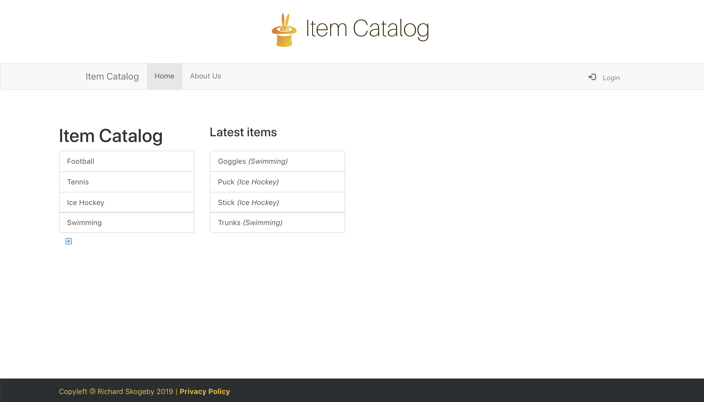

# Item Catalog

Web application that allows users to add, edit and delete items and categories
in an item catalog.

## About

Item Catalog is a web application written in Python 3 using the Flask framework.
It serves up a website that allows you to create, view, update and delete
categories and items in the catalog.  All logged in users can add items for
public display. Users can edit their own entries. Login functionality
is added using the Google OAuth2 API.

## Requirements

- Python 3.7
- [flask](https://pypi.org/project/Flask/)
- [flask_login](https://pypi.org/project/Flask-Login/)
- [oauth2client](https://pypi.org/project/oauth2client/)
- [httplib2](https://pypi.org/project/httplib2/)
- [SQLAlchemy](https://pypi.org/project/SQLAlchemy/)
- [requests](https://pypi.org/project/requests/)
- [dotenv](https://pypi.org/project/python-dotenv/)

## Design

The web application was made to implement a user controlled relational database
open for public viewing. Users are authorized to:

1. Add new categories.
1. Edit and delete categories they have created.
1. Add new items sorting under their own categories.
1. Edit and delete items they have created.



Authentication is done through either signing in using your google account,
or by registrering as a user and logging in to the application. The database
does not save the password itself. The passwords are used to generate a 256-bit
hash, which in turn is stored in the database.

## Usage

Get a Google Client ID and Secret and download the client_secrets.json file.
Create an "instance" directory in your item-catalog folder:

``` bash
mkdir instance
```

In the root directory create a file named .env, add it to your .gitignore
and fill in the required information:

``` bash
import os
DATABASE_PASSWORD =
GOOGLE_CLIENT_ID =
GOOGLE_CLIENT_SECRET =
GOOGLE_REDIRECT_URI = http://mydomain:myport/login/authorized
LISTEN_INTERFACE = 0.0.0.0
LISTEN_PORT = 8080

```

Install required libraries:

``` bash
pip3 install -r requirements.txt
```

Set privileges to execute the run.py file:

``` bash
chmod 700 run.py
```

Launch the application:

``` bash
./run.py
```

Open your favourite browser (except for internet explorer) and go to

``` bash
http://localhost:8080
```

## License

[MIT](https://choosealicense.com/licenses/mit/)
